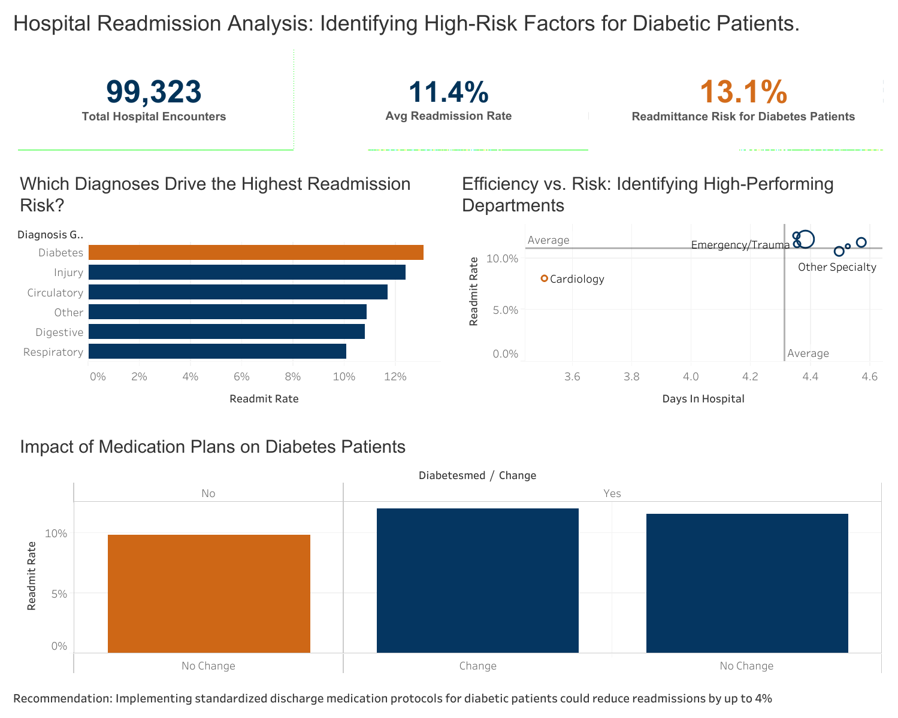
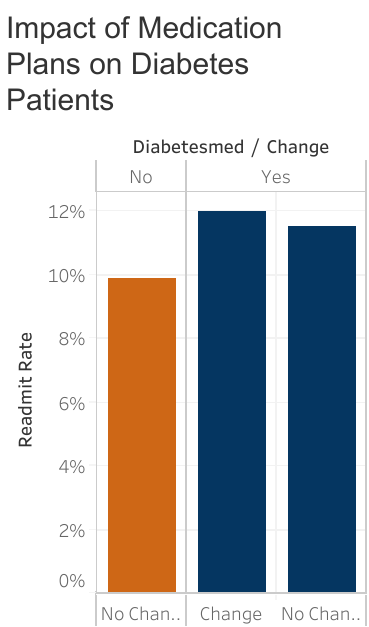

# Healthcare Efficiency & Risk Analysis for Patients With Diabetes

## 🚀 Executive Summary
This project is an end-to-end analysis of ~100k healthcare encounters to identify key drivers of 30-day hospital readmissions. This project focuses on high-risk diabetic patients and the impact of medication changes on patient outcomes.
---

## 📌 Business Problem
Hospital readmission rates are a critical metric for healthcare quality and financial stability. High readmission rates often indicate gaps in discharge planning or follow-up care. We are analyzing the specific factors that increase this risk within the diabetic population to provide actionable insights for clinical intervention.

---

## 🎯 Objectives
Key objectives:

- Identify High-Risk Diagnoses: Determine which primary diagnoses correlate with the highest readmission rates.

- Analyze Demographic Trends: Evaluate how age and diagnosis type interact to impact patient risk.

- Assess Treatment Impact: Quantify the relationship between medication changes (or lack thereof) and the likelihood of a 30-day readmission.

- Benchmark Performance: Compare departmental performance (Specialties) against the hospital-wide readmission average.

---

## 🧠 Approach
This project follows the **Google Data Analytics framework**:

**Ask → Prepare → Process → Analyze → Share → Act**

---

## 📊 Dataset
The analysis uses a comprehensive healthcare dataset covering 10 years of clinical encounters.

Key tables used in PostgreSQL:

    - Clinical Encounters: Patient visit details including diagnosis, length of stay, and specialty.

    - Demographics: Age groups and patient identifiers.

    - Medication Data: Tracking changes in diabetic medications and insulin administration.

Note: Data was filtered to exclude deceased patients and those discharged to hospice to ensure an accurate study of preventable readmissions.

---

## 🧹 Data Cleaning & Preparation
Data was cleaned and transformed using PostgreSQL. Key steps included:

    - Handling Nulls: Identified and managed missing values in clinical fields like weight and medical_specialty.

    - Data Normalization: Created views to join patient demographics with clinical encounter results.

    - Schema Correction: Verified and corrected column references (e.g., distinguishing between admission_type and descriptive IDs).

---

## 📊 Key Insights (Quick View)
Overall Readmission Rate: 11.2%

High-Risk Diagnosis: Diabetes (13.1% Readmission Rate)

The Treatment Gap: Patients with no documented medication changes showed a 15% readmission risk.

Top Performing Specialty: Cardiology (Maintained rates significantly below the hospital average).
---

## 📊 Interactive Dashboard
[View on Tableau Public](https://public.tableau.com/app/profile/greg.washam/viz/DiabetesDataAnalysis_17775820265220/HospitalReadmissionAnalysisIdentifyingHigh-RiskFactorsforDiabeticPatients_)

## 📸 Dashboard Preview

## 🔍 Detailed Insights

# High-Risk Clinical Profile: The Diabetes Outlier

  

The analysis identified Diabetes as the primary driver of readmission risk among all diagnosis groups. While the hospital's overall average readmission rate sits at 11.2%, diabetic patients exhibit a significantly higher risk at 13.1%. This suggests that current discharge protocols may not sufficiently account for the complexities of diabetic self-care or post-discharge glucose management.

# The "Treatment Gap": Impact of Medication Stagnation

  

A critical finding emerged when analyzing medication changes: patients who had no changes to their diabetic medications during their stay showed a 15% readmission rate. Conversely, patients with documented adjustments to their treatment plans saw lower rates. This "Treatment Gap" indicates that maintaining a static clinical approach during an acute encounter is a leading indicator for patient return within 30 days.

# Specialty Benchmarking: Cardiology vs. General Care

  

By benchmarking clinical specialties, the data reveals that Cardiology consistently maintains readmission rates below the hospital average, even when treating high-risk patients. This high performance suggests that the specialized discharge and follow-up protocols used in Cardiology could potentially be modeled and scaled to other departments to lower the overall hospital-wide readmission rate.

---

## 💡 Recommendations

To reduce the 15% risk identified in the "Treatment Gap," the hospital should implement a mandatory medication review for all diabetic patients prior to discharge, specifically targeting those whose prescriptions remained unchanged during their stay.

---

## 📈 Business Impact
### Financial Impact: Penalties & Cost Savings

Hospital readmissions are expensive. Under the Hospital Readmission Reduction Program (HRRP), the government (CMS)  penalizes hospitals by reducing their overall payments if their readmission rates are too high.

    

### Clinical Excellence: Closing the "Treatment Gap"

Finding that diabetic patients with no medication changes have a 15% readmission risk is a major red flag for the clinical team. This suggests that the current "standard of care" for some patients is too passive.

### Resource Optimization & Strategy

Hospitals have limited beds and staff. Every "preventable" readmission takes away a bed from a new patient who needs it.

   ---

## 🔑 Why This Matter

1. Identifying a 13.1% readmission risk points to where the hospital is losing money through federal penaltis.
2. Treating a patient a second time for the same issue often costs more than the initial stay, as the patient’s condition may have worsened.
3. Implementing a policy to require a medication review for all diabetic patients could directly save lives and prevent the physical and emotional stress of a patient having to return to the ER just days after being discharged.
4. Operational efficiency can be improved. The hospital can study what Cardiology is doing differently and apply those discharge protocols to the higher-risk Diabetes units. 
---

### Analyst Note: This analysis provides a roadmap for reducing federal penalties and improving patient health outcomes by targeting high-risk diabetic medication protocols.

---

## 🛠 Tools Used
- SQL  
- Tableau  
- Data Analysis  

---

## ⚠️ Challenges
- Large dataset: Utilized PostgreSQL to efficiently handle 100,000+ entries
- Missing specialist data: Categorized the missing data as "other" or "Unknown" to avoid skewing the specialty benchmarking

---

## 📂 Project Structure
- SQL queries for analysis  
- Tableau dashboard for visualization  